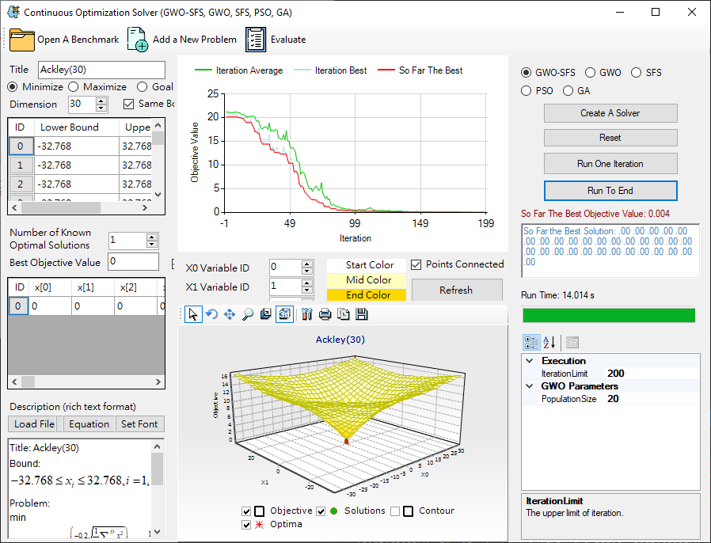
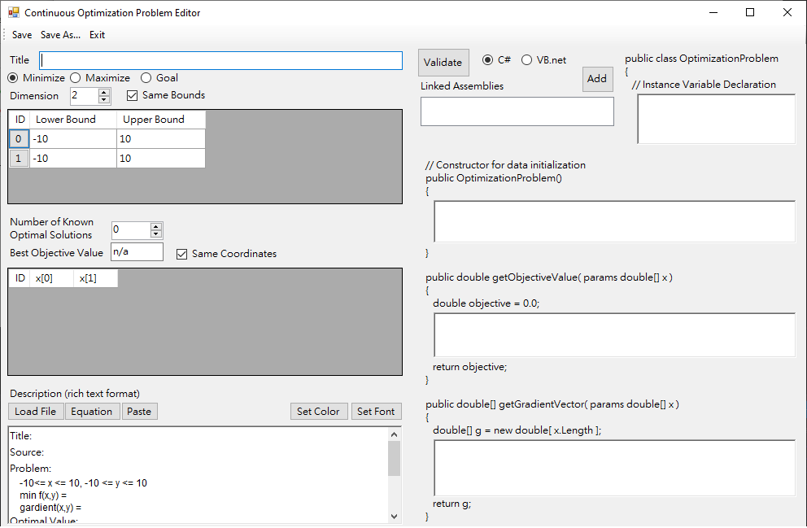
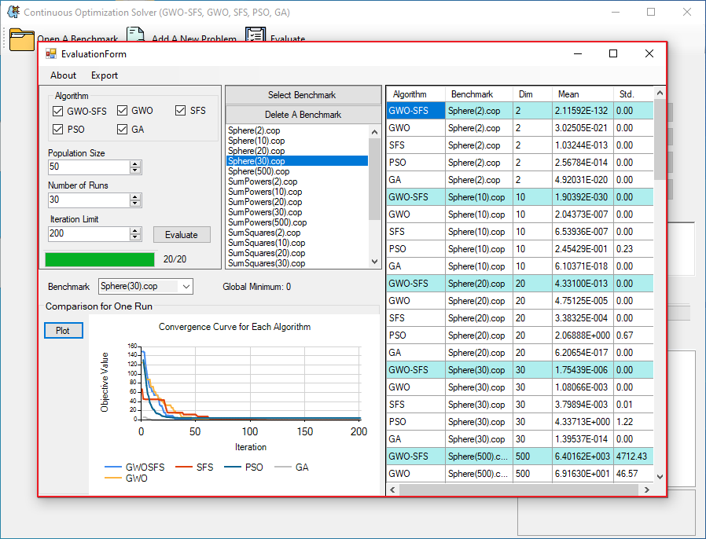

# SoftComputingProject

This project is dedicated to solving continuous optimization problems by *metaheuristic algorithms*, including Genetic Algorithm (GA), Particle Swarm Optimization (PSO), Grey Wolf Optimizer (GWO), Stochastic Fractal Search (SFS), Grey Wolf Optimization based Stochastic Fractal Search (GWO-SFS). There is an user interface which allows users to open a benchmark problem, create their own optimization problem, and evaluate the algorithms.

## Continuous Optimization Solver
### Functionalities
* **Solve continuous optimization problems**: Open A Benchmark -> Create A Solver -> Reset -> Run To End
* **Add a new problem**
* **Compare the algorithms and export the results**
  - Evaluate -> Select Benchmark (may select more than one benchmark problems at a time)
    1. Compare different algorithms: -> Evaluate (after hitting this button, you will get the results in the right panel in a table form, in which the columns are the name of the algorithm, benchmark problem, dimension, mean, standard deviation)
    2. Plot convergence plot: in the lower left corner, users may select a benchmark problem from the dropdown list and plot the convergence plot.
    3. Export the table: Export -> Table -> Result

### Interface Design
* Main User Interface
  
* Add a New Problem
  
* Evaluation Form
  
